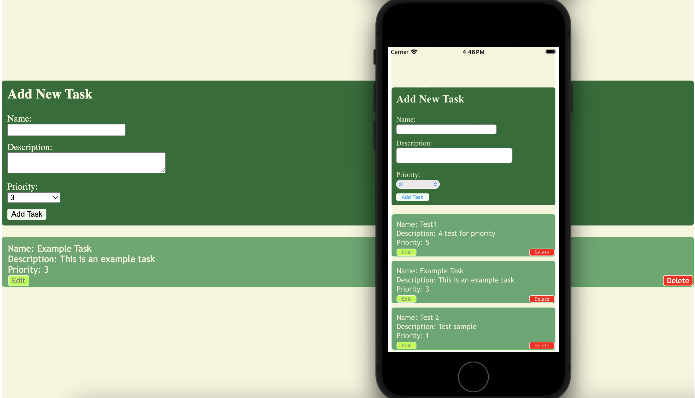

# Task Management App

This is a simple task management application. The application allows users to edit, delete, and modify tasks.

## App Structure

The framework of the app utilizes **React** for the frontend, **CSS** for styling, **Vite** for development, and **Capacitor** for building mobile apps on iOS.

## Features

1. The properties of a task include ID, name, description, and priority.
2. Users can add, edit, and delete tasks.
3. Tasks are automatically sorted from highest to lowest priority.

## How to Run

To run this app, follow the steps below:

1. Run the following command to start the development server:

   ```bash
   npm run dev
   ```

   This command will provide a URL. Navigate to this URL to access the web app.

2. To run the app on a mobile device, use the following command to open the project in Xcode:

   ```bash
   npx cap open ios
   ```

   After building the app succeeds, you can see how the app runs on mobile.

## Future Work

This app is a basic web app, containing only the frontend part. Therefore, functions like data storage are not yet implemented. This leads to a loss of newly added data when refreshing the page, as there is no interaction with the backend. In future work, with frontend and backend interaction, such situations will be avoided.

The current files have been successfully built and can run on both web and mobile platforms. In the future, containerizing the application will improve interaction with the backend.


